# JetBot Software Setup
## 1. Preparation
<!--
  - Video Instruction: https://youtu.be/6I9ZT5NKmsA
  - Official Instruction: https://jetbot.org/master/software_setup/sd_card.html
-->
- To setup your JetBot, you will need a PC, an HDMI display, a USB keyboard, and WiFi access.
<!--
  - We recommend you to follow the instruction below it includes some updates that are not included above.
-->
  
## 1. Flash JetBot SD Card Image
1. Download JetBot SD card image for Jetson Nano 4GB ```jetbot-043_nano-4gb-jp45.zip``` from [here](https://jetbot.org/master/software_setup/sd_card.html).

    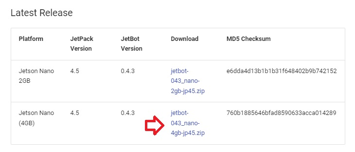

3. Download and install balenaEtcher from [here](https://www.balena.io/etcher/) to your PC.

        

4. Insert a microSD card into your PC.
5. Flash the JetBot SD card image ```jetbot-043_nano-4gb-jp45.zip``` onto the micro SD card using balenaEtcher.
    
    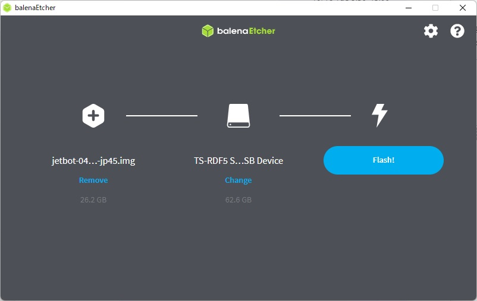

## 2. First Boot and WiFi Setup
1. Insert the microSD card into the JetBot.

    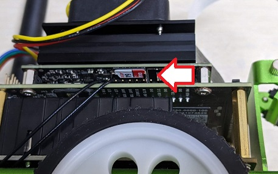

2. Plug an HDMI display and a USB keyboard into the JetBot.
3. Turn on the JetBot power switch to boot it.

    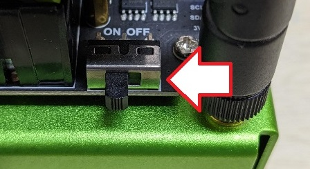

4. Log in using the username ```jetbot``` and the password ```jetbot```.

    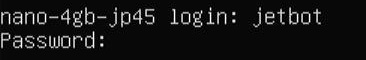

5. Check available WiFi by entering the command ```sudo nmcli device wifi list``` and the password ```jetbot```.

    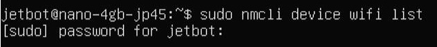

6. Connect to a network by using the command ```sudo nmcli device wifi connect <WiFi_SSID> password <WiFi_PASSWORD>```

    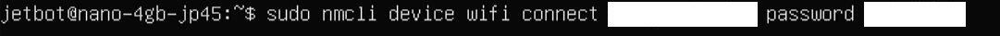

7. Shutdown the JetBot with the command ```sudo shutdown now```.
8. Turn off the JetBot power switch.
9. Unplug the HDMI display and the USB keyboard from the JetBot. You will no longer need the display and the keyboard.

## 3. Remote Access and Additional Setups
### Access to the JetBot via Web Browser
1. Boot the JetBot and wait for the JetBot to be connected to the WiFi automatically.
2. Note the IP address displayed on the JetBot's OLED display.

    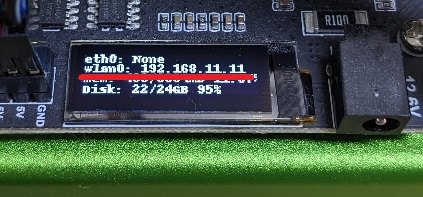

3. Ensure your PC is connected to the same WiFi network as your JetBot.
4. Open a web browser and access to ```http://<JETBOT_IP_ADDRESS>:8888```, for example, ```http://192.168.11.11:8888```.

    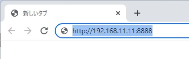

5. Log in to the JetBot with the password ```jetbot```.

    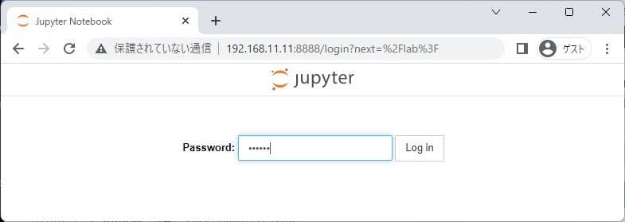

### Install SSH and Reconfigure Partition
1. Open the Terminal from the Launcher.

    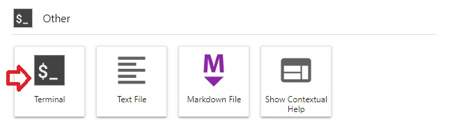

2. Update APT with the command ```apt update```.

    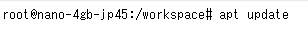

3. Install SSH with the command ```apt install ssh -y```.

    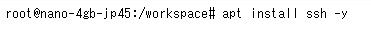


4. Log in via SSH with the command ```ssh jetbot@0.0.0.0``` then type ```yes``` and password ```jetbot```.

    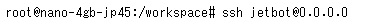

5. Reconfigure the partition with the following commands:
    ```
    cd jetcard
    git pull
    ./scripts/jetson_install_nvresizefs_service.sh
    ```
1. Shut down the JetBot with the command ```sudo shutdown now```.

1. Boot the JetBot again. You will now have more free disk space.

    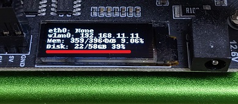

## 4. Regular Shutdown
After completing the setups above, you can shut down your JetBot from the terminal via your web browser.
1. Open a terminal from the Launcher.
1. Login via SSH with the command ```ssh jetbot@0.0.0.0``` then type ```yes``` and password ```jetbot```.
2. Shutdown the JetBot with the command ```sudo shutdown now``` with the password ```jetbot```.
